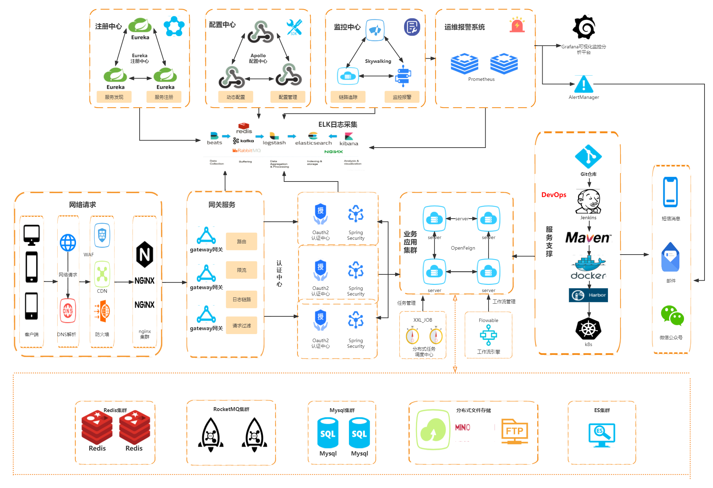

### 项目备注
项目：KCloud-Platform  
作者：老寇  
语言：Java  
职位：Java工程师  
时间：2020.06.08 ~ 至今  

### 项目介绍
KCloud-Platform（老寇云平台）是一款企业级微服务架构的云服务平台。基于Spring Boot 2.7.5、Spring Cloud 2021.0.4等最新版本开发，
遵循SpringBoot编程思想，高度模块化和可配置化。具备服务注册&发现、配置中心、限流、熔断、降级、监控、多数据源、工作流、高亮搜索、定时任务、分布式缓存、分布式事务、分布式存储等功能，用于快速构建微服务项目。目前支持Shell、Docker等多种部署方式，实现RBAC权限、其中包含系统管理、系统监控、工作流程、数据分析等几大模块。
遵循阿里代码规范，代码简洁、架构清晰，非常适合作为基础框架使用。   

### 功能介绍
用户管理  
角色管理  
菜单管理  
部门管理  
日志管理  
字典管理  
消息管理    
认证管理  
搜索管理  
资源管理  
流程定义  
流程任务  
接口文档  
数据监控  
服务监控  
主机监控  

### 系统架构


### 技术体系

#### Spring全家桶及核心技术版本
| 组件                | 版本       |
|:------------------|:---------|
| Spring Boot       | 2.7.5    |
| Spring Cloud      | 2021.0.4 |
| Spring Boot Admin | 2.7.5    |
| Apollo            | 1.4.0    |
| Mysql             | 5.7.9    |
| Redis             | 6.0.6    |
| Elasticsearch     | 7.6.2    |
| Kafka             | 2.8.1    |

> Spring 全家桶版本对应关系，详见：[版本说明](https://github.com/alibaba/spring-cloud-alibaba/wiki/%E7%89%88%E6%9C%AC%E8%AF%B4%E6%98%8E)

#### 相关技术

- API 网关：Spring Cloud Gateway
- 服务注册&发现：Eureka
- 配置中心: Apollo
- 认证授权：Spring Security OAuth2
- 服务消费：Spring Cloud OpenFeign & RestTemplate & OkHttps
- 负载均衡：Spring Cloud Loadbalancer
- 服务熔断&降级&限流：Resilience4j
- 服务监控：Spring Boot Admin、Prometheus
- 消息队列：使用 Spring Cloud 消息总线 Spring Cloud Bus 默认 Kafka
- 链路跟踪：Skywalking
- 数据库：MySQL、Oracle 
- 数据缓存：Redis
- 工作流：Flowable
- 日志中心：ELK
- 持久层框架：Mybatis Plus
- JSON 序列化：Jackson
- 文件服务：Local/阿里云 OSS/Fastdfs
- 服务部署：Docker-Compose
- 持续交付：Jenkins
- 服务发布：金丝雀发布

#### 项目结构
~~~
├── laokou-base
        └── laokou-async -- 异步组件
        └── laokou-bom -- 依赖版本库
        └── laokou-common -- 公共组件
        └── laokou-mybatis-plus mybatis-plus组件
        └── laokou-log -- 日志组件
        └── laokou-swagger -- 文档组件
├── laokou-cloud
        └── laokou-gateway -- API网关
        └── laokou-monitor -- 服务监控
        └── laokou-register -- 服务注册&发现
├── laokou-service
        └── laokou-admin -- 后台管理模块
        └── laokou-generator -- 模板模块
        └── laokou-security
                └── laokou-auth -- 认证授权模块        
                └── laokou-oauth2 -- 认证授权模块
                └── laokou-ump -- 认证授权模块
        └── laokou-modlule
                └── laokou-sms 短信模块 
                └── laokou-email 邮件模块
                └── laokou-oss 对象存储模块       
                └── laokou-cache
                        └── laokou-redis -- 缓存模块
                └── laokou-job
                        └── laokou-xxl-job 工作模块
                └── laokou-mq
                        └── laokou-kafka 消息模块
                └── laokou-search
                        └── laokou-elasticsearch 搜索模块
~~~

### 环境配置
#### 安装教程
[centos7 安装jdk1.8](https://kcloud.blog.csdn.net/article/details/82184984)  
[centos7 安装mysql5.7](https://kcloud.blog.csdn.net/article/details/123628721)  
[centos7 安装maven](https://kcloud.blog.csdn.net/article/details/108459715)  
[centos7 安装apollo](https://kcloud.blog.csdn.net/article/details/124957353)  
[centos7 安装redis](https://kcloud.blog.csdn.net/article/details/82589349)  
[centos7 安装fastdfs](https://kcloud.blog.csdn.net/article/details/116423931)  
[centos7 安装中文字体](https://kcloud.blog.csdn.net/article/details/106575947)  
[centos7 安装jenkins](https://kcloud.blog.csdn.net/article/details/112171878)  
[centos7 安装apr](https://kcloud.blog.csdn.net/article/details/125473896)  
[centos7 安装nacos](https://kcloud.blog.csdn.net/article/details/82589017)  
[centos7 安装elasticsearch7.6.2](https://kcloud.blog.csdn.net/article/details/123123229)  
[centos7 安装kafka](https://kcloud.blog.csdn.net/article/details/123771040)

#### 安装包
[百度网盘](https://pan.baidu.com/s/1swrV9ffJnmz4S0mfkuBbIw) 提取码：1111

### 项目配置
#### 服务配置
```yaml
  # mysql
spring:
  datasource:
    druid:
      # 连接地址
      url: jdbc:mysql://127.0.0.1:3306/kcloud?allowMultiQueries=true&useUnicode=true&characterEncoding=UTF-8&useSSL=false
      # 用户名
      username: root
      # 密码
      password: 123456
  # redis
  redis:
    #数据库索引
    database: 0
    #主机
    host: 127.0.0.1
    #端口
    port: 6379
    #连接超时时长（毫秒）
    timeout: 6000ms 
# elasticsearch
elasticsearch:
  #主机
  host: 127.0.0.1:9200
  #节点
  cluster-name: elasticsearch-node
```

#### 开启APR模式
##### 代码引入
```java
public class AuthApplication implements WebServerFactoryCustomizer<WebServerFactory> {
    @Override
    public void customize(WebServerFactory factory) {
        TomcatServletWebServerFactory containerFactory = (TomcatServletWebServerFactory) factory;
        containerFactory.setProtocol("org.apache.coyote.http11.Http11AprProtocol");
    }
}
```

##### VM options配置
```shell script
-Djava.library.path=./lib
```

#### 高版本JDK兼容
##### VM options配置
```shell script
--add-opens=java.base/java.lang=ALL-UNNAMED
```

### 数据权限
##### 代码引入
```java
@Service
public class SysUserApplicationServiceImpl implements SysUserApplicationService {

    @Autowired
    private SysUserService sysUserService;

    @Override
    @DataFilter(tableAlias = "boot_sys_user")
    public IPage<SysUserVO> queryUserPage(SysUserQO qo) {
        IPage<SysUserVO> page = new Page<>(qo.getPageNum(),qo.getPageSize());
        return sysUserService.getUserPage(page,qo);
    }
}
```
##### XML配置
```xml
<if test="qo.sqlFilter != null and qo.sqlFilter != ''">
    and ( ${qo.sqlFilter} )
</if>
```

### 金丝雀发布
##### Apollo配置
```yaml
[{
  {
    "id": "laokou-admin",
    "uri": "lb://laokou-admin",
    "predicates": [
      {
        "name": "Path",
        "args": {
          "_genkey_0": "/admin/**"
        }
      },
      {
        "name": "Weight",
        "args": {
          "_genkey_0": "admin",
          "_genkey_1": "50"
        }
      }
    ],
    "filters": [
      {
        "name": "StripPrefix",
        "args": {
          "_genkey_0": "1"
        }
      }
    ],
    "order": 0
  }
}]
```

### 演示地址
[http://175.178.69.253](http://175.178.69.253)  
admin/admin123  
test/test123  
laok5/test123  

### 项目截图
<table>
    <tr>
        <td></td>
        <td></td>
    </tr>
    <tr>
        <td></td>
        <td></td>
    </tr>
    <tr>
        <td></td>
        <td></td>
    </tr>
    <tr>
        <td></td>
        <td></td>
    </tr>
    <tr>
        <td></td>
        <td></td>
    </tr>
    <tr>
        <td></td>
        <td></td>
    </tr>
    <tr>
        <td></td>
        <td></td>
    </tr>
    <tr>
        <td></td>
        <td></td>
    </tr>
    <tr>
        <td></td>
        <td></td>
    </tr>
    <tr>
        <td></td>
        <td></td>
    </tr>
    <tr>
        <td></td>
        <td></td>
    </tr>
    <tr>
        <td></td>
        <td></td>
    </tr>
</table>